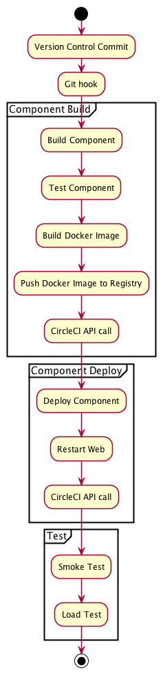

Checkout submodules:

    ./sync.sh

To start local cluster:

  minikube start
  kubectl apply -f deploy/manifests/
  minikube dashboard
  kubectl expose deployment web-deployment --port=80 --target-port=80 --type=NodePort
  open http://192.168.99.100:32374

TODO: how to access this?!  

Credit account:

    kubectl exec -it postgres-0 -- psql -U wallet wallet -c 'update wallet set balance = 1000;'

Release change log lock:

    kubectl exec -it postgres-0 -- psql -U wallet wallet -c 'delete from databasechangeloglock;''

# Architecture

