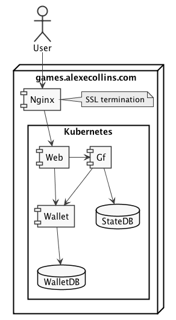

Checkout submodules, then install and start start local cluster:

    ./init.sh

Run tests:

  TODO

Credit account:

    kubectl exec -it walletdb-0 -- psql -U wallet wallet -c 'update wallet set balance = 1000;'

Release change log lock:

    kubectl exec -it walletdb-0 -- psql -U wallet wallet -c 'delete from databasechangeloglock;''

# Architecture

